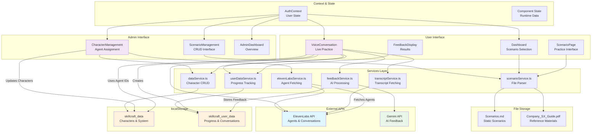

# SkillCraft Data Flow Visualization
*Visual representation of data flows and dependencies*

## System Architecture Overview



## Critical Data Pathways

### **1. Character-Agent Assignment Flow**
```
Admin Interface → ElevenLabs API → localStorage → Voice Conversation
     ↓               ↓                ↓              ↓
CharacterMgmt → elevenLabsService → dataService → VoiceConversation
     ↓               ↓                ↓              ↓
"Edit Character" → "Fetch Agents" → "Save Agent" → "Use Agent ID"
```

### **2. Conversation & Feedback Flow**
```
User Practice → ElevenLabs → Transcript → Gemini → localStorage
      ↓            ↓           ↓          ↓         ↓
ScenarioPage → VoiceConv → transcriptSvc → feedbackSvc → userDataSvc
      ↓            ↓           ↓          ↓         ↓
"Start" → "Live Conversation" → "Get Text" → "AI Analysis" → "Store Results"
```

### **3. Scenario Loading Flow**
```
File System → Service Cache → User Interface
     ↓           ↓              ↓
Scenarios.md → scenarioService → Dashboard/ScenarioPage
     ↓           ↓              ↓
"Static Data" → "Parse & Cache" → "Display Scenarios"
```

## Data Consistency Map

### **Consistent Flows** ✅
- **Character ↔ Agent Assignment**: Reliable localStorage persistence
- **Progress Tracking**: EWMA ratings with proper storage
- **Voice Integration**: Agent IDs flow correctly to conversations
- **Feedback Pipeline**: End-to-end transcript to feedback storage

### **Inconsistent Flows** ⚠️
- **User Authentication**: In-memory only, lost on refresh
- **Scenario-Character Links**: File-based vs localStorage split
- **Admin Scenario CRUD**: UI exists but doesn't persist to file
- **Past Conversations**: Stored but no access UI

## Storage Interaction Matrix

|Component|localStorage|Files|ElevenLabs|Gemini|
|---------|------------|-----|----------|------|
|**CharacterManagement**|✅ Read/Write|❌|✅ Fetch|❌|
|**ScenarioManagement**|❌|✅ Read Only|❌|❌|
|**VoiceConversation**|✅ Read/Write|❌|✅ Converse|❌|
|**Dashboard**|✅ Read|✅ Read|❌|❌|
|**FeedbackService**|✅ Write|❌|✅ Transcript|✅ Generate|
|**UserDataService**|✅ Read/Write|❌|❌|❌|

## Potential Data Conflicts

### **1. Character Assignment Conflicts**
```
Scenarios.md: assignedCharacterId: 1
localStorage: character.id: 1 (but different data)
Risk: Character data inconsistency
```

### **2. User State Loss**
```
User logs in → Practices → Page refresh → User lost
localStorage has progress but no user context
Risk: Orphaned progress data
```

### **3. Admin Changes Not Persisting**
```
Admin edits scenario → UI updates → File unchanged
Next reload: Changes lost
Risk: Admin frustration, data loss
```

## Recommended Fixes Priority

### **🔥 Critical (Data Loss Risk)**
1. **User Persistence**: Add user authentication to localStorage
2. **Scenario Persistence**: Connect admin CRUD to actual storage

### **⚠️ Important (Consistency Issues)**
3. **Unified Character-Scenario Assignment**: Single source of truth
4. **Past Conversations UI**: Access stored conversation history

### **💡 Enhancement (User Experience)**
5. **Data Migration Tools**: Handle localStorage schema changes
6. **Backup/Export Features**: Allow data export for safety

This analysis shows a solid core architecture with specific integration gaps that can be systematically addressed.